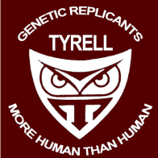

# Tyrell

Stack Deploy Utility for Zetta Cloud

Want to create a Zetta deployment with Latest CoreOS? Here's how!

## Vagrant

See [Getting Started Docs](https://github.com/apigee-internal/tyrell/wiki/Getting-Started-with-Tyrell)

[Overview of Link](https://github.com/apigee-internal/tyrell/wiki)

## Dependencies

- Vagrant
- Packer
- Virtualbox
- Docker for Mac
- AWS API Credentials

## Disclaimer

This is not an officially supported Google product.
